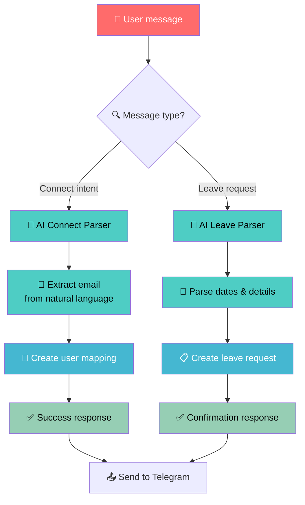

# Enhanced Telegram API Flow with AI-Powered Connect Command

## 🔗 Connect Command Flow with Gemini AI

```mermaid
flowchart TD
    A[👤 User sends connect message<br/>in Telegram] --> B[📡 Telegram webhook<br/>to Vercel API]

    B --> C{📨 POST /api/telegram/webhook}

    C --> D[📝 Extract message text]

    D --> E{🔍 Contains connect keywords?<br/>"/connect", "connect", "link"}

    E -->|No| F[🤖 Send to Gemini AI<br/>for general parsing]
    E -->|Yes| G[🎯 AI-Powered Connect Parsing]

    G --> H[🤖 Send connect prompt<br/>to Gemini API]

    H --> I[📧 Gemini extracts email<br/>from natural language]

    I --> J[📦 Returns JSON:<br/>{email: "user@domain.com"}]

    J --> K[📧 Validate email<br/>in profiles table]

    K --> L{✅ Email exists<br/>in system?}

    L -->|Yes| M[👥 Create telegram_users<br/>mapping record]

    L -->|No| N[❌ Send error:<br/>"Email not found in system"]

    M --> O[✅ Send success message<br/>with user details]

    N --> P[🏁 Return response]
    O --> P

    F --> Q[🤖 General AI parsing<br/>for leave requests]

    %% Styling
    classDef telegramClass fill:#0088cc,color:#ffffff,stroke:#006699,stroke-width:2px
    classDef aiClass fill:#4285f4,color:#ffffff,stroke:#3367d6,stroke-width:2px
    classDef databaseClass fill:#34a853,color:#ffffff,stroke:#2e7d32,stroke-width:2px
    classDef errorClass fill:#ea4335,color:#ffffff,stroke:#d33b2c,stroke-width:2px
    classDef successClass fill:#00c851,color:#ffffff,stroke:#009624,stroke-width:2px

    class A,B telegramClass
    class H,I,J aiClass
    class K,M databaseClass
    class N errorClass
    class O successClass
```

## 🤖 Gemini Connect Prompt

```markdown
You are an AI assistant that extracts email addresses from user messages about connecting Telegram accounts.

User message: "${message}"

Extract the email address the user wants to connect with.

Return JSON format only:
{
  "intent": "connect_account",
  "email": "extracted@email.com",
  "confidence": 0.0-1.0
}

Examples:
- "connect my account to john@example.com" → {"intent": "connect_account", "email": "john@example.com", "confidence": 0.9}
- "please link this telegram to mary@company.com" → {"intent": "connect_account", "email": "mary@company.com", "confidence": 0.95}
- "/connect user@domain.com" → {"intent": "connect_account", "email": "user@domain.com", "confidence": 1.0}
- "I want to connect" → {"intent": "unknown", "confidence": 0.3}

Return only JSON, no other text.
```

## 🔄 Complete Flow with AI Connect



## 📝 Example User Messages

### ✅ Supported Connect Messages:
- `/connect john@example.com`
- `connect my account to john@example.com`
- `please link this telegram to mary@company.com`
- `I want to connect mary@company.com`
- `link my telegram account with user@domain.com`
- `connect user@domain.com to this chat`

### ✅ Supported Leave Messages:
- `Take 3 days leave today for family matters`
- `I need sick leave tomorrow`
- `Please approve my vacation from Jan 15-17`
- `ขอลาวันนี้ 3 วัน เรื่องงานครอบครัว`

## 🔧 Implementation Code

```typescript
// Enhanced handleConnectCommand with AI
async function handleConnectCommand(message: TelegramMessage) {
  // Send to Gemini for email extraction
  const connectPrompt = `Extract email from: "${message.text}"`
  const aiResponse = await parseWithGemini(connectPrompt)

  if (aiResponse.intent === 'connect_account' && aiResponse.confidence > 0.7) {
    const email = aiResponse.email

    // Validate and create mapping
    // ... existing validation code
  } else {
    // Fallback to regex or ask for clarification
    await sendTelegramReply(message.chat.id, 'Please specify your email clearly')
  }
}
```

## 🎯 Benefits of AI-Powered Connect

### ✅ Natural Language Support:
- Users can type in any natural way
- No strict format required
- More user-friendly

### ✅ Better UX:
- Handles variations in phrasing
- Supports multiple languages
- Contextual understanding

### ✅ Flexibility:
- Can expand to extract more info
- Handles typos and variations
- Learns from examples

### ✅ Consistency:
- Same AI parsing as leave requests
- Unified approach across features
- Maintains code quality

---

**Connect Command Flow ที่มี Gemini AI จะทำให้ user สามารถพิมพ์ได้ naturally!** 🚀

**จาก "please connect my account to john@example.com" → AI extract email → Create mapping!** 🤖

**UX ที่ดีขึ้นและรองรับ natural language!** 💬

