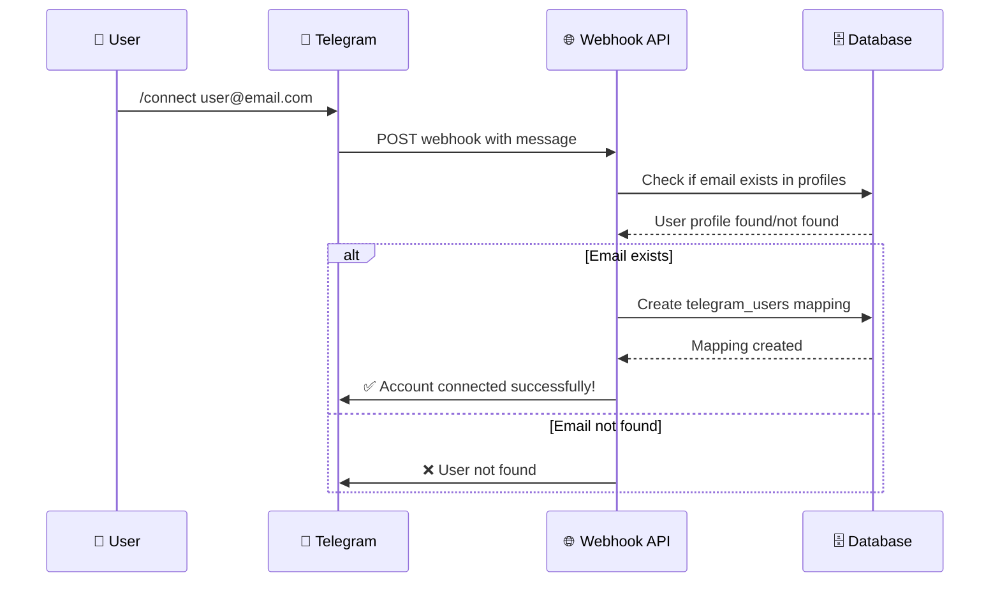

# Telegram API Flow Diagram

## 📱 Telegram Bot API Flow

```mermaid
flowchart TD
    A[👤 User sends message<br/>in Telegram] --> B[📡 Telegram API<br/>sends webhook<br/>to Vercel]

    B --> C{📨 POST /api/telegram/webhook<br/>Next.js API Route}

    C --> D[📝 Parse message<br/>from request body]

    D --> E{🔍 Check message type}

    E -->|"/connect email"| F[🔗 Handle Connect Command]
    E -->|Other message| G[🤖 Parse with Gemini AI]

    F --> H[📧 Validate email<br/>in profiles table]
    H --> I{✅ Email exists?}
    I -->|Yes| J[👥 Create user mapping<br/>in telegram_users table]
    I -->|No| K[❌ Send error:<br/>"User not found"]
    J --> L[✅ Send success:<br/>"Account connected"]
    K --> M[🏁 Return response]
    L --> M

    G --> N[🎯 Send prompt to<br/>Gemini AI API]
    N --> O[📊 Get JSON response<br/>with parsed data]

    O --> P{🔍 Check confidence<br/>& intent}

    P -->|Low confidence<br/>or unknown| Q[❓ Send help message<br/>with examples]
    P -->|High confidence<br/>leave_request| R[👤 Find user mapping<br/>by telegram_user_id]

    Q --> M

    R --> S{✅ User mapping<br/>exists?}
    S -->|No| T[❌ Send error:<br/>"Account not connected"]
    S -->|Yes| U[📋 Create leave request<br/>in database]

    T --> M

    U --> V[📅 Generate date range<br/>from start/end dates]
    V --> W[💾 Insert to<br/>leave_requests table]

    W --> X[📤 Send success message<br/>to Telegram]
    X --> Y[✅ Send confirmation<br/>with leave details]

    Y --> M

    M --> Z[🏁 Return<br/>{ok: true}]

    %% Styling
    classDef telegramClass fill:#0088cc,color:#ffffff,stroke:#006699,stroke-width:2px
    classDef aiClass fill:#4285f4,color:#ffffff,stroke:#3367d6,stroke-width:2px
    classDef databaseClass fill:#34a853,color:#ffffff,stroke:#2e7d32,stroke-width:2px
    classDef errorClass fill:#ea4335,color:#ffffff,stroke:#d33b2c,stroke-width:2px
    classDef successClass fill:#00c851,color:#ffffff,stroke:#009624,stroke-width:2px

    class A,B telegramClass
    class N,O aiClass
    class H,J,U,V,W databaseClass
    class K,T errorClass
    class L,X,Y successClass
```

## 🔄 Alternative Flow: Connect Command



## 🤖 AI Parsing Flow

```mermaid
flowchart LR
    A[📝 Raw message<br/>"Take 3 days leave today"] --> B[🤖 Gemini AI<br/>with prompt]

    B --> C[🎯 Parse intent<br/>leave_request]

    C --> D[📅 Extract dates<br/>start_date, end_date]

    C --> E[💬 Extract reason<br/>"family matters"]

    C --> F[🏷️ Classify type<br/>"Personal Leave"]

    C --> G[📊 Calculate confidence<br/>0.9]

    D --> H[📦 JSON Response]
    E --> H
    F --> H
    G --> H

    H --> I[✅ Validated &<br/>used for leave request]
```

## 📋 Key Components

### 🗂️ Files Involved:
- `app/api/telegram/webhook/route.ts` - Main webhook handler
- `lib/database.ts` - Database operations
- `lib/holidays.ts` - Holiday utilities (not used in bot)

### 🔧 Functions:
- `parseMessageWithGemini()` - AI parsing
- `handleConnectCommand()` - User connection
- `findUserByTelegramId()` - User lookup
- `createLeaveRequest()` - Database insert
- `sendTelegramReply()` - Response sending

### 🔄 Data Flow:
1. **Input**: Telegram message text
2. **Processing**: AI parsing → validation → user lookup
3. **Output**: Database insert → success response
4. **Error Handling**: Help messages for unclear requests

### ⚡ Performance:
- **AI Call**: ~1-2 seconds (Gemini API)
- **Database**: ~100-500ms (Supabase)
- **Response**: ~200-500ms (Telegram API)

---

**Flow นี้แสดงการทำงานแบบ end-to-end ของ Telegram Bot API ในระบบ!** 🚀

**จากข้อความธรรมดา → AI parsing → database → response!** 🤖

